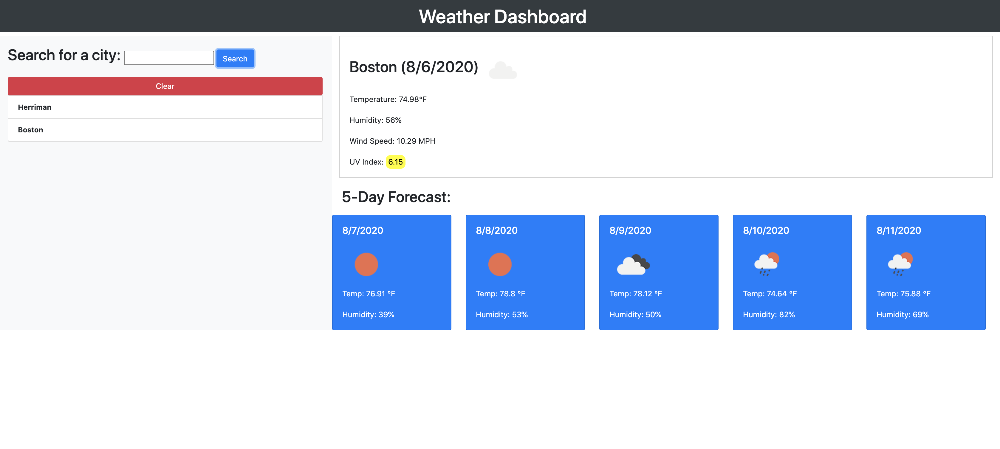

# weather-dashboard
A weather dashboard app for showing current weather temperatures from a selected city.

## Instructions
* Search for any city
* Weather data is displayed on the left for that city
* The search term is stored under the search bar and persists on reload
* click the clear button to clear the search terms

## Functions
* Search for any city
* City is added to search history
* Weather data is presented for each city using the openweathermap api
* The UV Index is given with a color if good, moderate, or bad
* Forecasted weather data is shown for 5 days
* When user clicks on city in search history the data pulls up for that city

## The App

All the code for this app was written by Jaydon Goodrich

The deployed  site can be found at https://jaydon-goodrich.github.io/weather-dashboard/

